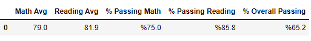
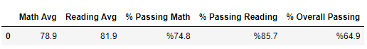

# School-District-Analysis

This analysis will provide valuable information that the school district will use to allocate funds and resources.

We used Pandas mainly for its greater functionality when working with these larger datasets especially when faced with the special case of missing or null data.

---

## Results

___Effects of Dropping Possible Cheaters___

Because the district suspects there to have been systemic cheating among Thomas High School 9th graders, their scores were removed from the dataset in this analysis.
- Doing so barely changed the district summary
  - 
  - 
  - Thomas High School's averages were so close to the averages for the whole district that the change was within a rounding error for most measures
- The school summary was only affected if you include the 9th graders as 0s, otherwise all values are within a rounding error
- Replacing the 9th graders' math/reading scores only has an effect on Thomas High School's performance if the grades are processed as 0s

- Thomas High School removal Effect on various metrics
  -
  1. Thomas HS sits in the $630-644 bin so all other ranges of per student spending remain unchanged
     * the greatest change goes from 79 -> 65.6 in the overall passing % column
  2. With Thomas HS removed all passing percentages take a small dip around 5%
  3.  Charter scores also suffered due to Thomas HS's absence
---
## Summary

I used Pandas in this analysis to digest a large sum of data with dataframes that made it easy to reprocess that data with new information. Pandas' NaN type combined with its useful dataframe object made it possible to remove the math and reading scores of only the Thomas HS 9th graders. This allowed me to find corrected metrics for the district. Overall the corrections were not incredibly substantial, but they did lower the metrics for certain subgroupings of the dataset. For instance, charter schools dominate the district schools in scores but with the removal of Thomas HS 9th, their scores are a little more equalized. This can also be seen in every other subgrouping that contains Thomas HS. 

